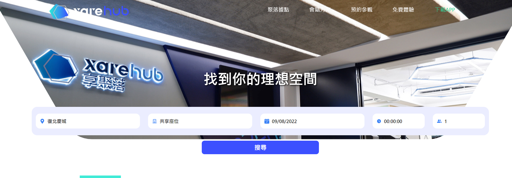

# xarehub
> A web page with responsive design.
> Live demo [_here_](https://drizztduncan.github.io/xarehub/). <!-- If you have the project hosted somewhere, include the link here. -->

## Table of Contents
* [General Info](#general-information)
* [Technologies Used](#technologies-used)
* [Features](#features)
* [Screenshots](#screenshots)
* [Setup](#setup)
* [Usage](#usage)
* [Project Status](#project-status)
* [Room for Improvement](#room-for-improvement)
* [Acknowledgements](#acknowledgements)
<!-- * [License](#license) -->

## General Information
- Building a responsive design web page
- Use different UI libraries
- Practice React.js's hook function
<!-- You don't have to answer all the questions - just the ones relevant to your project. -->

## Technologies Used
- React.js - version 18.1.0
- Tailwind css - version 3.1.1
- Ant design - version 4.21.4
- Swiper - version 8.3.1
- Headless UI - version 1.6.6

## Features
List the ready features here:
- Drop down menu

- Carousell(./src/img/carousell.gif)
- Calendar, time select function
- Scroll back to top function

## Screenshots

<!-- If you have screenshots you'd like to share, include them here. -->

## Setup
What are the project requirements/dependencies? Where are they listed? A requirements.txt or a Pipfile.lock file perhaps? Where is it located?

Proceed to describe how to install / setup one's local environment / get started with the project.

## Project Status
Project is: _on going_

## Room for Improvement
Responsive design better develope from mobile device to web device.

Room for improvement:
- Carousell needs to resize in pad device
- footer's contents are missing in pad device

To do:
- Resize carousell's img size
- Adjust footer's content size

## Acknowledgements
Give credit here.
- This project was inspired by xarehub offecial site.
- Many thanks to frontend developers from [Taiwan Code Camp](https://taiwancodecamp.com/)

<!-- ## Contact -->
<!-- Created by [@flynerdpl](https://www.flynerd.pl/) - feel free to contact me! -->

<!-- Optional -->
<!-- ## License -->
<!-- This project is open source and available under the [... License](). -->

<!-- You don't have to include all sections - just the one's relevant to your project -->
